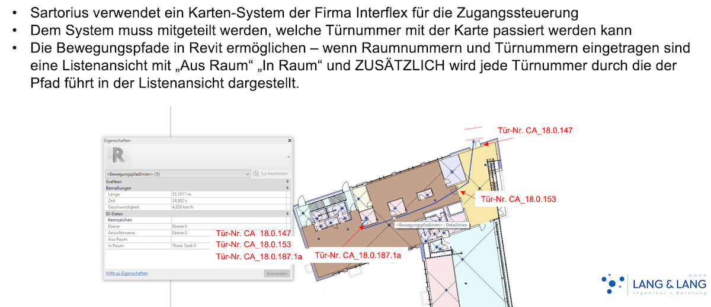

# PathOfTravelDoors

Revit C# .NET add-in determining the doors traversed by path of travel.

## Original Request &ndash; Revit Bewegungsplan

Türnummern jeder einzelnen Türe durch die man gehen muss in der Tabelle des Bewegungspfades ausgeben.

Aktuell werden in der Tabelle die Zwischentüren nicht angezeigt.

Hintergrund: Wir haben ein zentrales Zutrittssystem mit Karten und Schlüssel.
Wenn jemand in einen bestimmten Raum muss, muss erst der Weg durch die vielen Türen gefunden werden, für die die Karte dieser Person im diesem System berechtigt werden muss.
Im Bewegungsplan in Revit ist es möglich Routen durch ein Gebäude zu planen.
Für jedes Gebäude haben wir ein Revit Modell.
Mit dem Modell von CA_18 haben wir die Bewegungsroute ausprobiert.
Es funktioniert wunderbar und auch der Weg als Route ist abspeicherbar, was für die Parametrisierung des Zutrittssystems perfekt ist.
Was noch fehlt: in der Tabellenausgabe der Route die einzelnen Türnummern auflisten; aktuell wird nur die erste und die letzte Tür angezeigt.

 <!-- 1200 x 520 pixels -->

## Discussion with the Revit Development Team

[Q] question on doors traversed by a path of travel: a customer wishes to add a list of all the doors that need to be crossed to follow a path of travel. what would be the easiest way to determine this list, please?
i pondered the question myself and guessed at this approach: the PoT is a detail line. tesselate it to obtain straight line segments. for each line segment, run a ReferenceIntersector checking for door hits. collect those, and you are done.
is there an easier way, maybe?

[A] yes I think that would be the right approach. Something to note though is that path of travel is already composed of multiple shorter lines. If there are turns, those lines could be very short. PathOfTravel.GetCurves will return those lines to you &ndash; you can safely assume they are lines.

[A] That's the way &ndash; I've done this a few times in a Dynamo for Revit context, dating all the way back to 2018, before Revit implemented a path of travel element.
Devpost writeup here: [Life Safety Life Savers](https://devpost.com/software/life-safety-life-savers)
 &ndash;  automate life safety plans governed by any building code found online.

[Q] So, the Life Safety Life Savers writeup was implemented before the advent of the Path of Travel functionality? But it does determine a path of travel itself, plus determine a list of doors to pass through along that path, implemented using the ReferenceIntersector? I ask, because  that may be exactly what I need, and all i need. This question is for a proof of concept, and that would suffice, I think.

[A] It’s been awhile, but I believe that was the initial POC when we talked about moving it to ‘pure Revit’ from a Geometry.DoesIntersect node in Dynamo.
I believe that a pure Revit API method could utilize either the ReferenceIntersector you mentioned, or a filtered element collector with an ElementIntersects method applied. A slow filter I know, but since you can limit to doors in the view which the path of travel was drawn it’s likley a small number of tests. Not sure about which of the two is faster as I haven’t used the referenceintersector at scale. Likely worth a test, and documenting the performance of the two might be a worthwhile effort.
Since it’s been two years since I last looked into the topic of calculating egress capacity I may play around with this topic later this week.
Note that when the app was fully fleshed out Matt Mason (who wrote the bulk of the add-in) switched to using properties of the rooms and doors themselves, as a graph consisting of the ‘far point’ of each room, the perimeter curves around the room, the door points (and associated doors), and the a skeleton of the corridors were used for drawing the path of travel. Since we already had the doors in the graph, and the sequence of rooms which had to pass though each door, reusing that data wound up being significantly faster.

## Author

Jeremy Tammik,
[The Building Coder](http://thebuildingcoder.typepad.com),
[Autodesk Platform Services APS](http://aps.autodesk.com),
[ADN](http://www.autodesk.com/adn)
[Open](http://www.autodesk.com/adnopen),
[Autodesk Inc.](http://www.autodesk.com)

## License

This sample is licensed under the terms of the [MIT License](http://opensource.org/licenses/MIT).
Please see the [LICENSE](LICENSE) file for full details.
